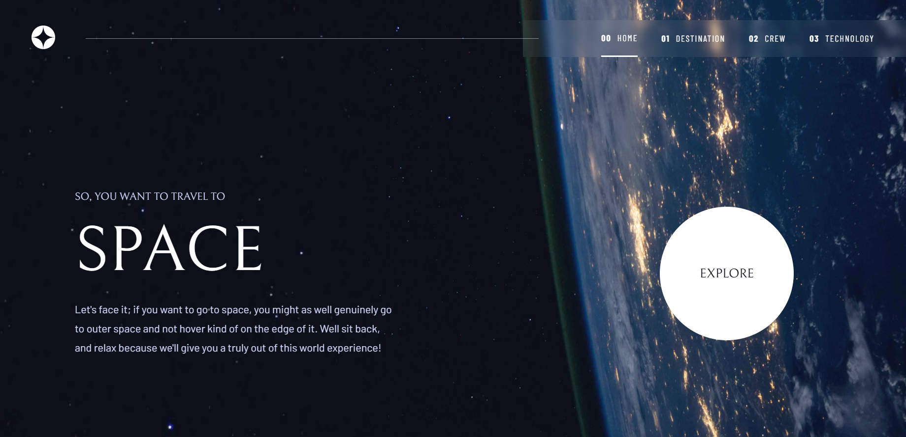

<h1 align="center"> Space Tour 💻 </h1>

## Status 🔧

Almost done. Lacks a few tweaks and animations.

## Requirements 📄

- View each page and be able to toggle between the tabs to see new information
- View the optimal layout for each of the website's pages depending on their device's screen size
- See hover states for all interactive elements on the page

## Alerts ⚡

- > [FrontendMentor Challenge Page](https://www.frontendmentor.io/challenges/space-tourism-multipage-website-gRWj1URZ3?tab=downloads)

- > [Live Project Link](https://spac3tour.netlify.app)

## Goal 📌

- Serve as proof of skill in my portfolio.

---

<h3 align="center"> Home 📷 </h3>

    

<h3 align="center"> Tecnologias utilizadas 🤖 </h3>

> 

>   
>   
> 

